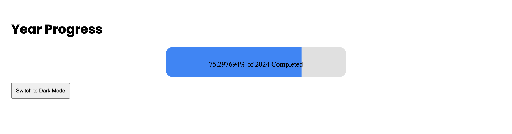
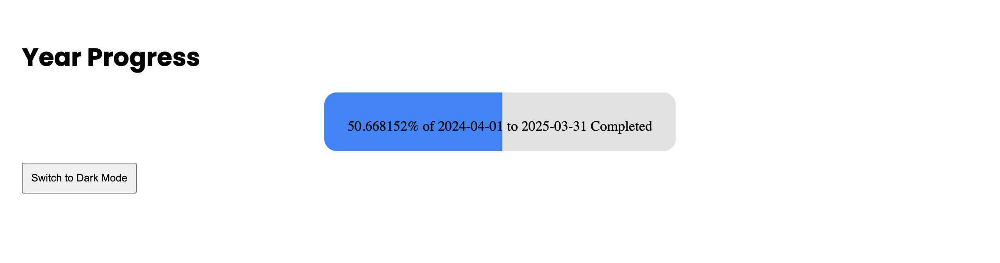
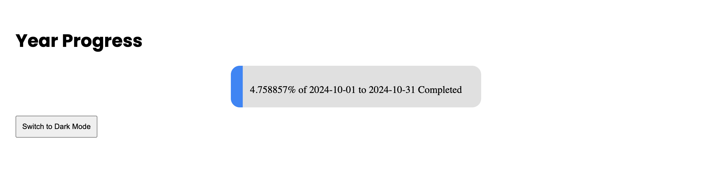

# Year In Progress

<div align="center">
  
[](https://discord.com/invite/Yn9g6KuWyA)
[](https://www.youtube.com/@dhanushnehru?sub_confirmation=1)
[](https://dhanushn.substack.com/)

</div>

A simple yet effective progress bar that visually represents the percentage of the year (or any custom date range) that has passed. This dynamic progress bar updates in real-time and supports both standard and dark themes, as well as flexible date ranges.

# Features
- Displays the progress of the current year by default.
- Supports custom date ranges (e.g., fiscal years, project timelines).
- Two themes available: light and dark.
  
# Getting Started

## Run the project locally

### Prerequesites
Ensure you have the following installed:
- [Node.js](https://nodejs.org/)

### Installation
1. Clone the repository:
   ```bash
   git clone https://github.com/yourusername/year-progress-api.git
   cd year-progress-api
    ```
2. Install dependencies
    ```bash
    npm install
    ```
3. Start the server
    ```bash
    node app.js
    ```
4. Open your browser and navigate to:
    ```bash
    http://localhost:3000/year-progress
    ```

## Gitpod
In the cloud-free development environment where you can directly start coding.

You can use Gitpod in the cloud  [](https://gitpod.io/#https://github.com/DhanushNehru/year-in-progress/)

## Usage

### Default Year Progress
By default, the project will show the progress of the current year (from January 1st to December 31st)
```bash
http://localhost:3000/year-progress
```

Screenshot:


### Custom Date Ranges
You can pass custom startDate and endDate query parameters to track the progress of a specific date range, such as fiscal years or project timelines.

You have to specify the exact startDate and endDate in the YYYY-MM-DD format.

Example 1: Custom Fiscal Year (April 1, 2024 to March 31, 2025)
```bash
http://localhost:3000/year-progress?startDate=2024-04-01&endDate=2025-03-31
```

Screenshot:


Example 2: Progress of a Single month (October 2024, screenshoted on October 2)
```bash
http://localhost:3000/year-progress?startDate=2024-10-01&endDate=2024-10-31
```

Screenshot:


### Query parameters
```startDate``` (optional): The start date in ```YYYY-MM-DD```.<br>
```endDate``` (optional): The end date in ```YYYY-MM-DD```.<br>
```theme``` (optional): Can be dark or standard (default). It helps changing the theme of the progress bar.

### Where to modify the URL and see live changes
To see the changes of the progress bar in real-time, you can change the date range in the URL in the index file and refresh the page.

Change the lines below:
```html

```
```javascript
document.getElementById('progress-img').src = `https://year-in-progress.vercel.app/year-progress?time=${Date.now()}&startDate=2024-04-01&endDate=2025-03-31&theme=${theme}`
```

To:
```html

```
```javascript
document.getElementById('progress-img').src = `http://localhost:3000/year-progress?time=${Date.now()}&startDate=2024-04-01&endDate=2025-03-31&theme=${theme}`
```

You can change the date range and theme as per your requirement.

----

Feel free to update the README.md or raise issues if any to enhance the project

## Contributors 💖

Thanks to all the amazing contributors who have helped make a thriving community! 🌟

<a href="https://github.com/DhanushNehru/year-in-progress/graphs/contributors">
    
</a>

